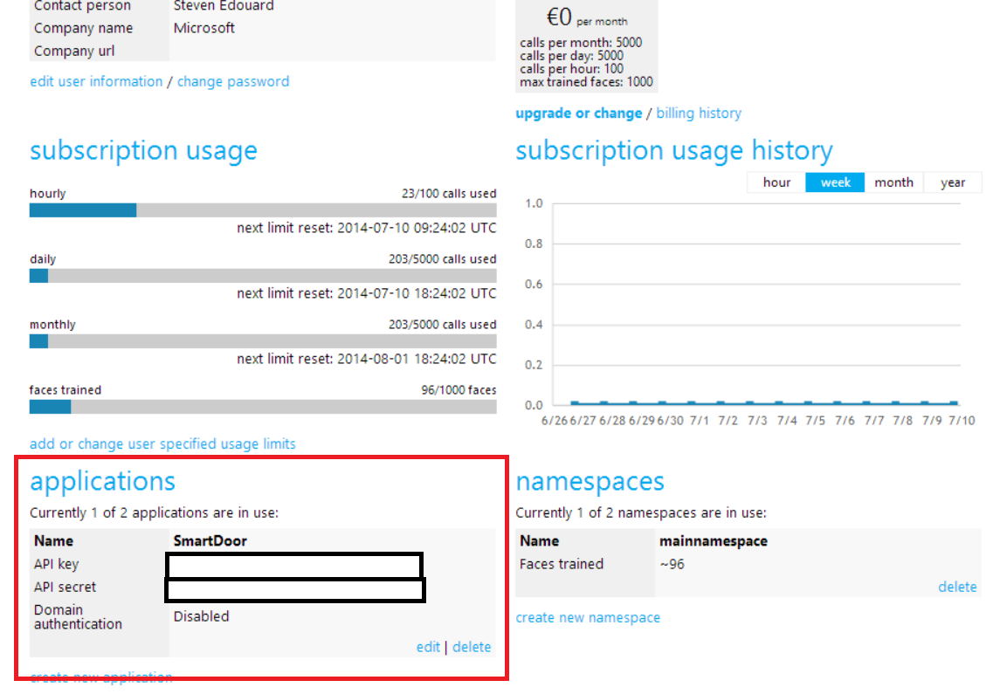
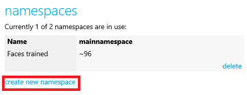
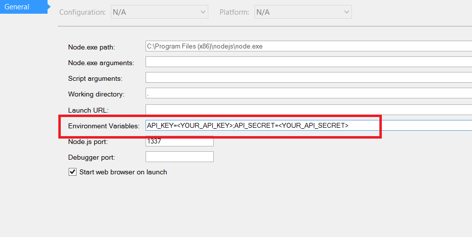
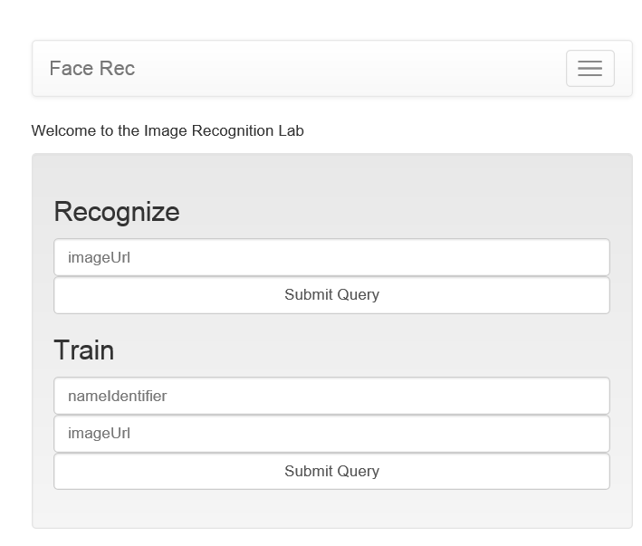
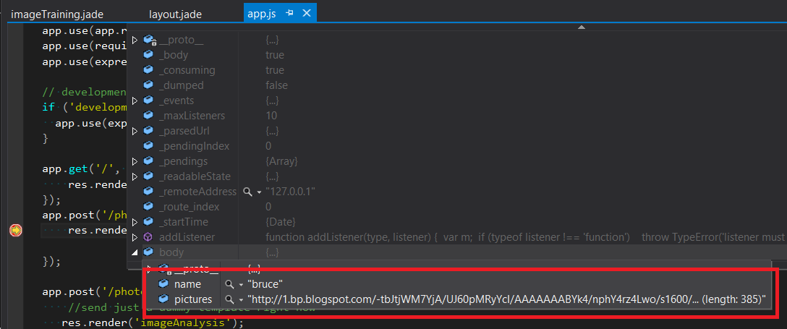
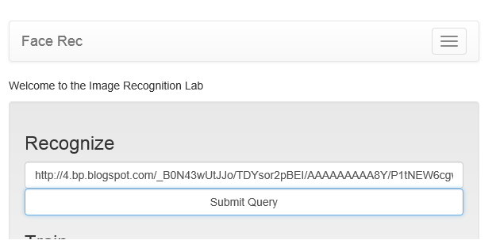
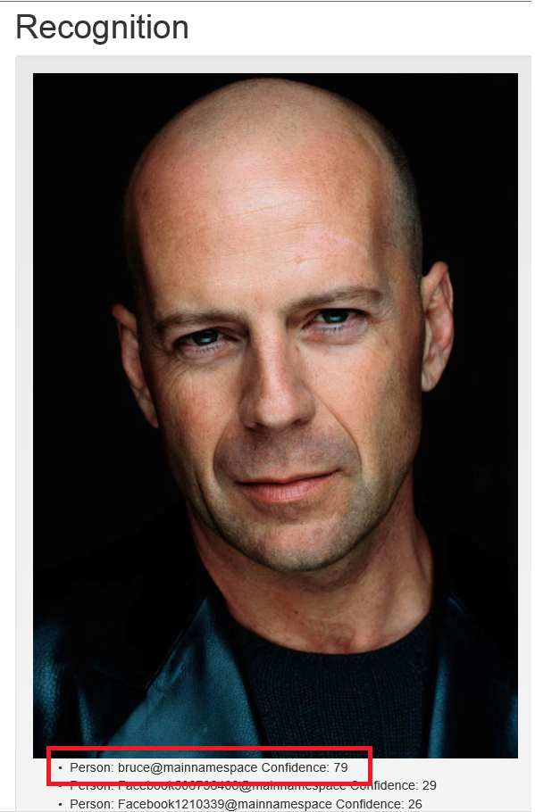

# Using 3rd Party Apis to Provide Facial Recogition

## Objective

By the end of this lab you will know:

1. How to use an API for a practical purpose
2. The importance of keeping your API secrets, secret
3. Usage restrictions of APIs


## Introduction

3rd Party APIs similar to what we used in the BartNOW application allow our app to come to life with data that we would have otherwise may have had to spend a very long time to create ourselves.

API market places actually come very handy for this as they curate APIs for you and make it simple to test, access and purchase API subscriptions. APIs are usually free for a very small amount of usage. As your API usage increases so will your bill for using that API. So you should always be considerate about how often you call one.

## Getting Started


### Getting your API key

To do this lab you must have an API key from [Skybiometry Facial Recogition](https://skybiometry.com/). (Click on the 'Sign in' button a register for a **free** account).

Skybiometry is a company that offers an API which provides facial recogition services. When you sign up you are provided with an **API Key** and a **API Secret**. We will keep these values on our server and use them as environment variables. After signing up you should see your API Key and Secret in the Sky Biometry user account page here:



### Creating a Namespace

You need to create a namespace after you sign up. On the account under **namespaces** click **create a new namespace**.





Although you can call it whatever you want, be sure to call the namespace **mainnamespace** or the code samples **will not work**.

### Setting up Visual Studio Solution

Open up the starter project, [StartProject/FacialRecognitionLab/FacialRecognitionLab.sln](StartProject/FacialRecognitionLab/FacialRecognitionLab.sln) and ensure to **install the missing npm packages**:


Because we want to keep our **API Key** and **API Secret** out of our code and possibly in the hands of other people, lets place them as environment variables in the project properties window:



In the **Environment Variables** text box you should have:

	API_Key=Your_API_Key;API_SECRET=Your API Secret

Do not share these values with other people.


The current solution already includes the basic routes and the client .jade files for a basic app that will excercise the SkyBiometry image api.

Run the application and you will see that you have 2 menus, the first for recognizing existing faces for tracking. The second is for registering new faces for identification:



Neither of the dialogs currently work and if you try clicking on either you will Jade crashes because of the data model not being rendered correctly.

### The Layouts

The layout jade files for the **Recognize** and **Train** menu's have been premade for this lab.

**imageAnalysis.jade**
```jade

extends layout

block pageTitle
    h1 Recognition

block pageContent

    .well
        img(src='#{photoUrl}')
        ul
            each uid in uids
                li Person: #{uid.uid} Confidence: #{uid.confidence}

```

The **imageAnalysis** view will display the image of the face requested to be identified. It will display the guesses from the API we will eventually call out to, listing the person it thinks it is plus the confidence threshold. 

**imageLayout.jade**

```jade

extends layout

block pageTitle
    h1 Image Training Analysis
    h2 #{data.status}
block pageContent
   
    each analysis in data.photos
        .well(style='text-algin:center')
            //add a canvas element which we will draw the image onto with the in-line javascript
            //img(src='#{analysis.url}' height='300' width='300')
            canvas(id="#{analysis.pid}", width="#{analysis.width}", height="#{analysis.height}")
            
            ul
                li Center (#{analysis.tags[0].center.x}, #{analysis.tags[0].center.y})
                li eye_left (#{analysis.tags[0].eye_left.x}, #{analysis.tags[0].eye_left.y})
                li eye_right (#{analysis.tags[0].eye_right.x}, #{analysis.tags[0].eye_right.y})

            //canvas.photo-canvas
            script(type='text/javascript').
                var photoUrl = '#{analysis.url}'
            
                //create a canvas with teh same width and height as image
                var canvas = document.getElementById("#{analysis.pid}");
                var ctx = canvas.getContext('2d');
                var img = new Image();
                img.src = photoUrl;
                ctx.drawImage(img, 0, 0);
                ctx.strokeStyle = 'rgba(240,0,0,1)';

            
                var eye_left = {
                    x : '#{analysis.tags[0].eye_left.x}',
                    y: '#{analysis.tags[0].eye_left.y}'
                };
                var eye_right = {
                    x : '#{analysis.tags[0].eye_right.x}',
                    y: '#{analysis.tags[0].eye_right.y}'
                };
                var nose = {
                    x : '#{analysis.tags[0].nose.x}',
                    y: '#{analysis.tags[0].nose.y}'
                };
                ctx.beginPath();
                //ctx.arc(x,y,radius,start rad, stop rad)
                ctx.arc(eye_left.x, eye_left.y, 5, 0, 2 * Math.PI);
                ctx.arc(eye_right.x, eye_right.y, 5, 0, 2 * Math.PI);
                ctx.arc(nose.x, nose.y, 10, 0, 2 * Math.PI);
                ctx.stroke();

```

The **imageLayout** view simply prints out each picture. The messy part you see above is the javascript that must be generated for each image so that we can visualize the data reflecting the location of the mouth and the eyes. We will not go into detail of the drawing code in this lab.


## Calling out to the Facial Recogntion API

In order to provide the acutal image recognition service for our app, we need to make 3 API calls which are specific to the SkyBiometry API:

    1) Call faces/detect with a list of image urls in order to collect a list of tag ids. These tags are kind of like a pointer to faces detected in pictures.

	2) Once we call faces/detect we will be given a collection of tag ids or tids. We will then call the tags/save endpoint which will save the tag ids we were previded in from the previous API response.

	3) Finally we will call the faces/train API to train the 3rd party system to understand what a particular tag, or a particular face looks like.


After these steps are completed for the 'Train' menu, we just need to call the faces/recognize api with the url of the image of the person to be identified.


### Creating the form POST route, /phototrain

### Step 1: Using faces/detect to get the tag ids
The first thing to do is to add a call to the **faces/detect** API with our API key and secret along with the list of image urls. We will get the list of image urls from the **Train** form:


This form is a standard HTML5 form and it's jade markup us:

```jade

	.form-group
            form(method='post', action='/phototrain')
                input(type='text', name='name', class='form-control', placeholder='nameIdentifier')
                input(type='text', name='pictures', class='form-control', placeholder='imageUrl')
                input(type='submit', class='form-control', placeholder='Train')

```

When the user hits the '**Submit Query** button the route **/phototrain** will be hit with a POST request with all the form data in the body. You can see this under the debugger if you place a breakpoint within your **index** route:




We will use the **req.body.pictures** for the **faces/detect** **urls** query parameter for our REST request:

(don't forget, every call to the API must have api_key and api_secret query parameters)

**app.js**
```js
unirest.get(serviceRoot+"faces/detect?api_key=" + process.env.API_KEY + "&api_secret=" + process.env.API_SECRET + "&urls=" + req.body.pictures
    ,function (faceDetectResponse) {

        if (faceDetectResponse.error) {
            return res.send(500, { message : faceDetectResponse.error });
        }
	}
);
```

Its important to know that you must pass in a **comma seperated list of image URLS** from the browser. Under Advanced Rest Client, the data coming from SkyBiometry face recogntion looks something like this:

```js

{
	status: "success"
	photos: [4]
	0:  {
		url: "http://1.bp.blogspot.com/-tbJtjWM7YjA/UJ60pMRyYcI/AAAAAAABYk4/nphY4rz4Lwo/s1600/bruce_willis18.jpg"
		pid: "F@00cb860c6e1d22411b572fa10602f640_d5dc098da738e"
		width: 1500
		height: 1093
		tags: [1]
		0:  {
			uids: [1]
			0:  {
				uid: "bruce@mainnamespace"
				confidence: 100
			}-
	
			label: null
			confirmed: true
			manual: false
			width: 44.4
			height: 60.93
			yaw: 3
			roll: -7
			pitch: 0
			attributes: {
				face: {
					value: "true"
					confidence: 74
				}-
			}-
			points: null
			similarities: null
			tid: "02e201d5_d5dc098da738e"
			recognizable: true
			center: {
				x: 49.2
				y: 42.91
			}-
			eye_left: {
				x: 62.47
				y: 23.7
				confidence: 55
				id: 449
			}-
			eye_right: {
				x: 35.73
				y: 28.91
				confidence: 54
				id: 450
			}-
			mouth_center: {
				x: 49.47
				y: 70.91
				confidence: 62
				id: 615
			}-
			nose: {
				x: 49.07
				y: 50.41
				confidence: 59
				id: 403
			}-
		}-
		...
	}-
}

```

Notice how we get a **tid** under the tag array. If we call **tags/save** we can save this tag under a particular **userid** which allows us to associate someones face with training sets of their photos. (We also recieve general facial recognition data such as the position of the eyes and mouth on the image).

The next thing to do is to iterate through all the photos that were passed to the API and collect the **tid's** into one long string that is split up by commas:

**app.js**
```js

//FOR THIS DEMO WE ARE ONLY GOING TO GET ONE PHOTO. The user should ensure photos have only one face
        var body = faceDetectResponse.body;
        var tags = "";
        for (var i in body.photos) {
            
            if (body.photos[i].tags) {
                //we make the enforcement tha the client only sends pictures of people with only 1 face in it.
                //we do this because we don't want to deal with the complexity of multiple faces in training pictures
                if (body.photos[i].tags.length > 1) {
                    response.send(400, { message: 'You must send photos with clearly only 1 face in it. This photo has more than one face ' + body.photos[i].url });
                    return;
                }
                
                if (body.photos[i].tags.length === 1) {
                    tags += body.photos[i].tags[0].tid + ',';
                }
                //0 tags just means no faces detected
            }
        }
		
		//check if we didn't get any faces at all. If so, error out.
        if (tags.length == 0) {
            response.send(400, { message: 'None of the photos you sent had faces in it. ' + body.photos[i].url });
            return;
        }
		
		console.log('Got the tag ids: ' + tags);
		//this is a place-holder response for now
        res.render('imageTraining');

```

After this code executes we will have a list of **tids** in the **tags** string variable which we can use to train the API for certain faces. Run the server, pass in a list of images of 1 face and you will see that the **tags** string variable contains a comma delimited string of special **tids** which point to each face recognized in the photos passed in:


On the server you will see the output list of tag ids:


**Note:** This example uses pictures of Bruce Willis. You can use this string of comma delimited photo urls. The name we assigned for the faces in this training set is bruce for Bruce Willis. **Name should be only 1 word!**:


http://1.bp.blogspot.com/-tbJtjWM7YjA/UJ60pMRyYcI/AAAAAAABYk4/nphY4rz4Lwo/s1600/bruce_willis18.jpg,http://www.hdwallcloud.com/wp-content/uploads/2013/02/Bruce-25.jpg,http://www2.pictures.zimbio.com/gi/Bruce+Willis+Cinema+Society+OC+Concept+Screening+u5DPspMS5uIl.jpg,http://2.bp.blogspot.com/-U26turb9yDE/UByoIbnNIbI/AAAAAAAAPWM/0-EFlhVfhmA/s1600/Bruce+Willis+new+wallpaper+2012+01.jpg


### Step 2 Using tags/save API to save the photo tags for training

Now that we have our list of tag id's, we need call the **tags/save** API to save tags and associate them with an **userid** which is provided by the **name** from the web form.

To do this we make another REST api call with unirest. Here are the url parameters you need to pass (besides api_key and api_secret)


1. **uid:** the user id you want to associate with the faces appended with **@NAME_SPACE_NAME**. This namespace is the namespace that you created when signing up for a SkyBiometry account.
2. **tids:** a comma delimited list of tag ids. We already have this in the **tags** string variable

```js
...continued from above
	console.log('Got the tag ids: ' + tags);
	//this is a place-holder response for now
    res.render('imageTraining');

	//save the tags tagged as the name provided
    unirest.get(serviceRoot + "tags/save?api_key=" + process.env.API_KEY + "&api_secret=" + process.env.API_SECRET + "&uid=" + req.body.name + '@' + 'mainnamespace' + "&tids=" + tags,
    function (tagSaveResponse) {
		//if we have an error return back a 500 error to the client
        if (tagSaveResponse.error) {
            return res.send(500, tagSaveResponse.error);
        }

    });

```
Now our entire **/phototrain** route looks like this:

```js

app.post('/phototrain', function (req, res) {
    
    unirest.get(serviceRoot + "faces/detect?api_key=" + process.env.API_KEY + "&api_secret=" + process.env.API_SECRET + "&urls=" + req.body.pictures
    , function (faceDetectResponse) {
        
        if (faceDetectResponse.error) {
            return res.send(500, { message : faceDetectResponse.error });
        }
        
        var body = faceDetectResponse.body;
        var tags = "";
        for (var i in body.photos) {
            
            if (body.photos[i].tags) {
                //we make the enforcement tha the client only sends pictures of people with only 1 face in it.
                //we do this because we don't want to deal with the complexity of multiple faces in training pictures
                if (body.photos[i].tags.length > 1) {
                    response.send(400, { message: 'You must send photos with clearly only 1 face in it. This photo has more than one face ' + body.photos[i].url });
                    return;
                }
                
                if (body.photos[i].tags.length === 1) {
                    tags += body.photos[i].tags[0].tid + ',';
                }
                //0 tags just means no faces detected
            }
        }
        console.log('Got the tag ids: ' + tags);
        
        //check if we didn't get any faces at all. If so, error out.
        if (tags.length == 0) {
            response.send(400, { message: 'None of the photos you sent had faces in it. ' + body.photos[i].url });
            return;
        }
        
        //save the tags tagged as the name provided
        unirest.get(serviceRoot + "tags/save?api_key=" + process.env.API_KEY + "&api_secret=" + process.env.API_SECRET + "&uid=" + req.body.name + '@' + 'mainnamespace' + "&tids=" + tags,
        function (tagSaveResponse) {
            
            //if we have an error return back a 500 error to the client
            if (tagSaveResponse.error) {
                return res.send(500, tagSaveResponse.error);
            }

        });

        //this is a place-holder response for now
        res.render('imageTraining');
    });

});

```

### Step 3: Using the **faces/train** API to start facial recognition training

We need to do one more thing with this API to actually save the faces for training. Calling **faces/train** with unirest will do the trick. The single url parameter you need to pass is the **uids** parameter which will be **userid@NAME_SPACE_NAME**. You could pass more than one user to start the training for a batch of people as well.


```js

..continued from above

	//save the tags tagged as the name provided
        unirest.get(serviceRoot + "tags/save?api_key=" + process.env.API_KEY + "&api_secret=" + process.env.API_SECRET + "&uid=" + req.body.name + '@' + 'mainnamespace' + "&tids=" + tags,
        function (tagSaveResponse) {
            
            //if we have an error return back a 500 error to the client
            if (tagSaveResponse.error) {
                return res.send(500, tagSaveResponse.error);
            }

            //now execute the training for the set of images provided for the face
            unirest.get(serviceRoot + "faces/train?api_key=" + process.env.API_KEY + "&api_secret=" + process.env.API_SECRET + "&uids=" + req.body.name + '@' + 'mainnamespace',
            function (faceTrainResponse) {

                if (tagSaveResponse.error) {
                
                    return res.send(500, faceTrainResponse.error);
                
                }

				
				//this is a place-holder response for now
        		res.render('imageTraining');
            });

        });

```

### Step 4: Converting Coordinates from Percentages to Pixels

Accoridng to the [documentation](https://skybiometry.com/Documentation#reference) the API will return the coordinates of interesting things such as eyes, nose and mouth in X Y coordinates as **percentages of the width and height**, respectivley.

In order for the javascript code in the **imageTraining** template to draw the points of interest correctly, we need to convert these percentages back to pixels.


**app.js**

```js

		if (tagSaveResponse.error) {
	                
	        return res.send(500, faceTrainResponse.error);
	    
	    }
	
		for (var i in faceDetectResponse.body.photos) {
	                    
	        //api will resize images to max width/height of 1024. However it won't reflect that in width/height
	        //field of each photo returned. So change it here
	        var photo = faceDetectResponse.body.photos[i];
	        
	        //remember, we assume 1 tagged face in each photo
	        var tag = photo.tags[0];
	        
	        //coordinates of interesting points are returned in percentages and
	        //need to be re-calculated as absolute positions before rendering
	        tag.eye_left.x = (tag.eye_left.x / 100) * photo.width;
	        tag.eye_left.y = (tag.eye_left.y / 100) * photo.height;
	        tag.eye_right.y = (tag.eye_right.y / 100) * photo.height;
	        tag.eye_right.x = (tag.eye_right.x / 100) * photo.width;
	        tag.mouth_center.x = (tag.mouth_center.x / 100) * photo.width;
	        tag.mouth_center.y = (tag.mouth_center.y / 100) & photo.height;
	        tag.nose.x = (tag.nose.x / 100) * photo.width;
	        tag.nose.y = (tag.nose.y / 100) * photo.height;
	        
	    }
	    //this is a place-holder response for now
	    res.render('imageTraining');
	});
	
```

Finally, we need to return the rendered **imageTraining** view to the client with the facial recogntion data. The view template knows how to use the data from SkyBiometry as its backing model.

```js

	//return the list of images that were sucessfully used for training
    res.render('imageTraining', { data: faceDetectResponse.body });

```

Now that you know the data that is going to the model you can see that **imageTraining.jade** is looping through each picture, and for each picture creating a **canvas** with an HTML id tag that is assigned to the image **pid** which is returned by the API. It does something extra fancy and creates a block of javascript that will draw the image to the canvas and then draw circles on the eys and nose:

**imageLayout**

```jade

extends layout

block pageTitle
    h1 Image Training Analysis
    h2 #{data.status}
block pageContent
   
    each analysis in data.photos
        .well(style='text-algin:center')
            //add a canvas element which we will draw the image onto with the in-line javascript
            canvas(id="#{analysis.pid}", width="#{analysis.width}", height="#{analysis.height}")
            
            ul
                li Center (#{analysis.tags[0].center.x}, #{analysis.tags[0].center.y})
                li eye_left (#{analysis.tags[0].eye_left.x}, #{analysis.tags[0].eye_left.y})
                li eye_right (#{analysis.tags[0].eye_right.x}, #{analysis.tags[0].eye_right.y})

            //canvas.photo-canvas
            script(type='text/javascript').
                var photoUrl = '#{analysis.url}'
            
                //create a canvas with teh same width and height as image
                var canvas = document.getElementById("#{analysis.pid}");
                var ctx = canvas.getContext('2d');
                var img = new Image();
                img.src = photoUrl;

				//draw the image to the canvas
                ctx.drawImage(img, 0, 0);
                ctx.strokeStyle = 'rgba(240,0,0,1)';

            	//now draw circles over the eyes and nose
                var eye_left = {
                    x : '#{analysis.tags[0].eye_left.x}',
                    y: '#{analysis.tags[0].eye_left.y}'
                };
                var eye_right = {
                    x : '#{analysis.tags[0].eye_right.x}',
                    y: '#{analysis.tags[0].eye_right.y}'
                };
                var nose = {
                    x : '#{analysis.tags[0].nose.x}',
                    y: '#{analysis.tags[0].nose.y}'
                };
                ctx.beginPath();
                //ctx.arc(x,y,radius,start rad, stop rad)
                ctx.arc(eye_left.x, eye_left.y, 5, 0, 2 * Math.PI);
                ctx.arc(eye_right.x, eye_right.y, 5, 0, 2 * Math.PI);
                ctx.arc(nose.x, nose.y, 10, 0, 2 * Math.PI);
                ctx.stroke();

```

Run the application again, with the string of pictures you want to train and the **one word name** which describes the face in the photos. You will see the **imageTraining** view rendered. Each picture of the face will have the eyes and nose pointed out:


Now that we have our faces trained for a person, we can call another API to recognize a given picture.

## Using the API to Recognize a Person in a Photo

The best part about facial recognition today is that we can identify a person in a photo given that that we have given the API a sufficient trianing set. First we will start with our **/photorec** route:

**app.js**
```js

app.post('/photorec', function (req, res) {
    //send just a dummy template right now. View will crash because no model is available
   res.render('imageAnalysis');
});

```

### Calling the faces/recognize API to Identify Face

Using unirest, we will call the **faces/recognize** API with the provided photo URL from the form. This API takes a few url parameters. You can find the detailed explanation in the **[documentation]**(https://skybiometry.com/Documentation#reference):

1. **uids** The userIDs you want the API to consider as possible people in the photo. Use **ALL** to consider all users
2. **namespace** The namespace that you created when signing up
3. **detector** The type of face detector you want to use. We will use **aggresive** as it has the best accuracy (however it is the slowest)
4. **atttributes** Optional attirbutes parameter. Pass **none** for this.
5. **limit** The maximum number of guesses as to who the face is
6. **urls** The images you want to attempt have identified. We will just enter the 1 image 	provided by the form.

```js

app.post('/photorec', function (req, res) {
    //send just a dummy template right now
   res.render('imageAnalysis');

	unirest.get(serviceRoot + "faces/recognize?api_key=" + process.env.API_KEY + 
	"&api_secret=" + process.env.API_SECRET + "&uids=all" + "&urls=" + 
	req.body.picture + "&namespace=" + 'mainnamespace' + "&detector=aggresive&attributes=none&limit=3",
    function (response) {

        if (response.error) {
            res.send(500, response.error);
        }
        //because the API can return a success error code but not recognize any face we need to
        //check if we got a picture with a face detected.
        else if (!response.body.photos[0].tags || !response.body.photos[0].tags[0]) {
            res.send(400, { message: 'sorry, no photos detected in this image' });
        }
    });
});

```

Now we should remove the place holder response and render the **imageAnalysis** view with the the photo that was identified and the possible guesses the API has given us:

```js

	//remove this
	//send just a dummy template right now
    res.render('imageAnalysis');
```

```js
app.post('/photorec', function (req, res) {
    unirest.get(serviceRoot + "faces/recognize?api_key=" + process.env.API_KEY + 
        "&api_secret=" + process.env.API_SECRET + "&uids=all" + "&urls=" + 
        req.body.picture + "&namespace=" + 'mainnamespace' + "&detector=aggresive&attributes=none&limit=3",
    function (response) {

        if (response.error) {
            res.send(500, response.error);
        }
        //because the API can return a success error code but not recognize any face we need to
        //check if we got a picture with a face detected.
        else if (!response.body.photos[0].tags || !response.body.photos[0].tags[0]) {
            res.send(400, { message: 'sorry, no photos detected in this image' });
        }

        //there will only be 1 photo and 1 face in it
        var tag = response.body.photos[0].tags[0];
        
        //if a tag has any uids, it means that the api has some guesses about who this is!
        if (tag.uids) {
            
            res.render('imageAnalysis', { photoUrl: response.body.photos[0].url, uids: tag.uids });
        
        }
        else {
            res.send(400, { message: 'The API has no guesses as to who is in the photo' });
        }
    });
});
```

Now we can call our API by entering a photo URL in the **Recongize** menu:



An you can see an untrained photo of Bruce willis is recognized as **bruce@mainnamespace** with a confidence of 79%.

