Creating a Cooking Website with Express, Styus and Jade
=============

#Objective

In this lab we will use Express to create [**Node Recipies**](http://noderecipies.azurewebsites.net) a full fledged website which can scale to mobile browsers as well as to the desktop. By the end of this lab you will know

	1. How to write html templates with jade
	2. How to render a view with a jade template and a model using a route

#Getting Started

To get started open up the [**StartProject/ExpressWebsite.sln**](StartProject/ExpressWebsite.sln) in Visual Studio 2013. You will notice a few things different about this project than before.

The solution contains a few more things than before:

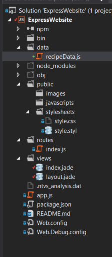

###Jade Files

Jade is a language used to create HTML templates on the server. This allows us to write HTML much easier because it avoid having to write as many brackets and also allows for us to **bind** to bind a view to the data model (similar to what Angular.js does in the browser).

###Stylus Files

Stylus is the Jade for CSS. It allows us to write CSS much easier than the raw CSS language.

###App.js

You will notice that there is considerably more stuff in your **app.js** than in the last lab. Lets take a peek at the setup:

The first new thing that happens is we set the views section of the app to the current directory, __dirname/views folder:

	
	//mounts the 'views' directory so that it is reachable by the client
	app.set('views', path.join(__dirname, 'views'));

We then instruct that our view engine that we will be using is jade. Express can be used with a variety of view engines, but jade is the most popular choice:
	
	app.set('view engine', 'jade');

This will set the favicon of the website to the default express.js image:
	
	app.use(express.favicon());

We will set that we want to use stylus and that the stylus styling files are in the **public** folder:

	app.use(require('stylus').middleware(path.join(__dirname, 'public')));

Lastly, we set our **public** folder to be publicly accessible by the client. After this call, you can access anything in this folder by browsing to it (such as **/stylesheets/style.styl**

	app.use(express.static(path.join(__dirname, 'public')));

Run the application and you'll see the placeholder 'Express' title:

##Templating HTML with Jade

[Jade](http://jade-lang.com/reference/) is a simple light-weight html templating engine which makes it easier to write and reuse HTML. 

The current solution has 2 jade view files:

**layout.jade**:

    //Layout.jade defines the layout of the entire website. It will contain the navbar and
	//extension views will populate pageTitle and pageContent blocks
	doctype html
	html
	  head
	    title= title
	
	    //indicate that our site is mobile optimized
	    meta(name='viewport', content='width=device-width, initial-scale=1.0')
	
	    //reference our site-specific css
	    link(rel='stylesheet', href='/stylesheets/style.css')
	
	    //add bootstrap dependencies from CDNjs. Using a CDN to distribute these files puts less pressure
	    //on our web server and will be delivered faster to the client than our own server.
	    script(src='//cdnjs.cloudflare.com/ajax/libs/jquery/2.1.1/jquery.min.js')
	    script(src='//cdnjs.cloudflare.com/ajax/libs/twitter-bootstrap/3.2.0/js/bootstrap.min.js')
	    link(rel='stylesheet', href='//cdnjs.cloudflare.com/ajax/libs/twitter-bootstrap/3.2.0/css/bootstrap-theme.min.css')
	    link(rel='stylesheet', href='//cdnjs.cloudflare.com/ajax/libs/twitter-bootstrap/3.2.0/css/bootstrap.min.css')
	  body
	    block pageContent

You can see that the layout.jade sort-of looks like HTML, except there aren't any brackets. Instead jade uses **tabs**. 

Notice how we have something called **block pageContent**. This tells jade that **layout.jade** will place any block named **pageContent** from an [*extension view*](http://www.devthought.com/code/use-jade-blocks-not-layouts/) it its place.

This same jade looks like this in HTML:

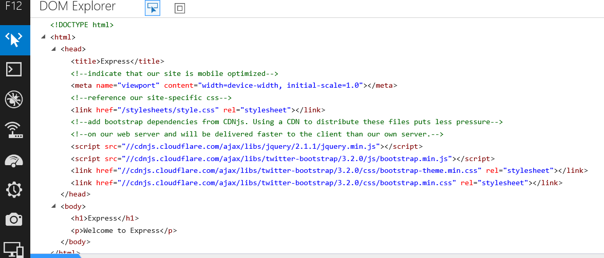

##Creating the Home Page

**Layout.jade** is pulling a references to [**Bootstrap**](http://getbootstrap.com/) which you used in BartNOW to create your responsive UI elements.

Each page on our website will contain a **pageTitle** and a **pageContent** block. Since we don't have a pageTitle block specified in Layout.jade, we'll add one above the pageContent block. Remember, **tabs matter!!**

    body
		block pageTitle
		block pageContent

Now run the website again:

You'll notice that nothing happens. This is because index.jade, the default page doesn't define the block pageTitle. Take a look at index.jade. Notice that this is an *extension view* of **layout.** That means that what's in pageContent will be placed in the pageContent block in layout.jade.

**index.jade**

    extends layout

	block pageContent
	  h1= title
	  p Welcome to #{title}

We can add a new block with a bootstrap [**jumbotron**](http://getbootstrap.com/components/#jumbotron) UI element:

	block pageTitle
		.jumbotron
			h1 Node Recipies
			h2 Welcome! Here you will find a variety of scruptious recipies for you to make

This jade code translates to this HTML:

	

		<h1>Node Recipies</h1>
		<h2>Welcome! Here you will find a variety of scruptious recipies for you to make</h2>
	

Tabs in jade signify child elements in the HTML. You don't have to worry about closing any tabs. **.jumbotron** could be **div.jumbotron** but jade defaults to the **div** element type if you don't specify one. Jade lets you short hand **class='jumbotron'** by simply just using **.classname** instead.

Your entire index.jade should now be:

    extends layout

	block pageTitle
        .jumbotron
            h1 Node Recipies
            h2 Welcome! Here you will find a variety of scruptious recipies for you to make

	block pageContent
	    h1= title
	    p Welcome to #{title}

Run the Website and now we have a landing page message:

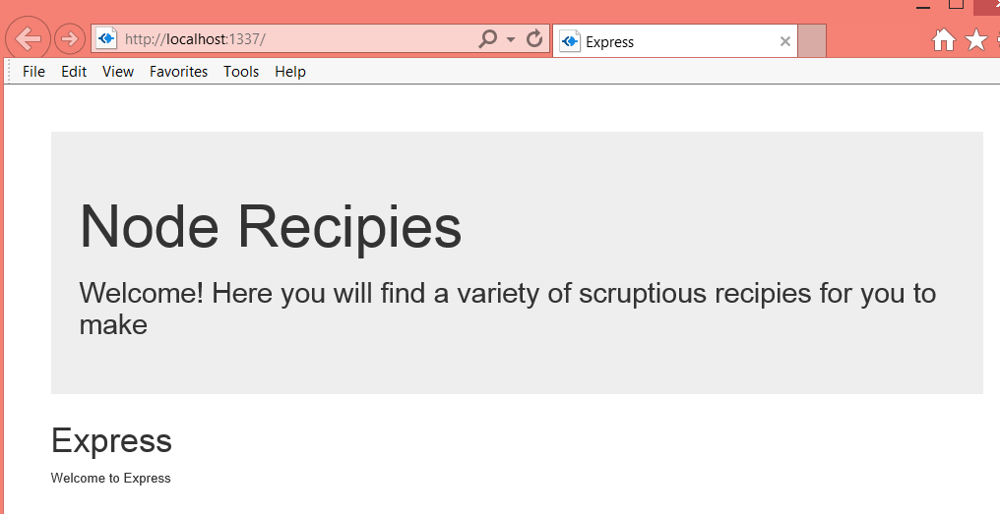

We don't want our site to have that pesky 'Express' tag on it so let's remove the pageContent block from our default view **index.jade**. It should now look like:

    extends layout

	block pageTitle
	        .jumbotron
	            h1 Node Recipies
	            h2 Welcome! Here you will find a variety of scruptious recipies for you to make
    
Now we should just have the jumbotron:

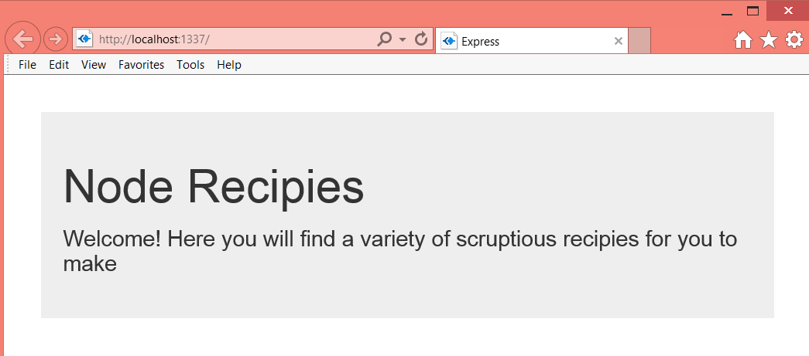

##Creating a Navigation Bar

Because **layout.jade** specifies how our web pages are laid out, it makes sense to put the bootstrap [**navbar**](http://getbootstrap.com/components/#navbar) here because every page should have a navigation bar:

The navbar will have 4 sections, **Home Page button**, **BBQ**, **Brunch**, **Dessert**. Each of these are the name of the kinds of recipes will eventually display on each page:

The HTML needed to create the navbar is:

    <nav role="navigation" class="navbar navbar-default">
		

			

				<button data-toggle="collapse" data-target="#bs-example-navbar-collapse-1" class="navbar-toggle">
					
					
					
					
				</button>
				<a href="/#" class="navbar-brand">Node Recipes</a>
			

			

				<ul class="nav navbar-nav">
					<li><a href="/recipes/bbq">BBQ</a></li>
					<li><a href="/recipes/brunch">Brunch</a></li>
					<li><a href="/recipes/dessert">Dessert</a></li>
				</ul>
			

		

	</nav>

The jade which produces this is (add this above **block pageTitle** in layout.jade):

    block navBar
        nav(class='navbar navbar-default', role='navigation')
            .container-fluid
                .navbar-header
                    button(class='navbar-toggle', data-toggle='collapse', data-target='#bs-example-navbar-collapse-1')
                        span.sronly
                        span.icon-bar
                        span.icon-bar
                        span.icon-bar
                    a(class='navbar-brand', href='/#') Node Recipes
                #bs-example-navbar-collapse-1(class='collapse navbar-collapse')
                    ul(class='nav navbar-nav')
                        li
                            a(href='/recipes/bbq') BBQ
                        li
                            a(href='/recipes/brunch') Brunch
                        li
                            a(href='/recipes/dessert') Dessert

As you can see it is *a lot* easier to write jade than it is raw HTML. Remember **block navBar** is just a jade specific marker which specifies the start of a new block. It doesn't render to any HTML.

Notice how each **li** element points to a [**route**](http://stackoverflow.com/questions/8864626/using-routes-in-express-js) on your server:

	ul(class='nav navbar-nav')
	    li
	        a(href='/recipes/bbq') BBQ
	    li
	        a(href='/recipes/brunch') Brunch
	    li
	        a(href='/recipes/dessert') Dessert

Now run your web site:

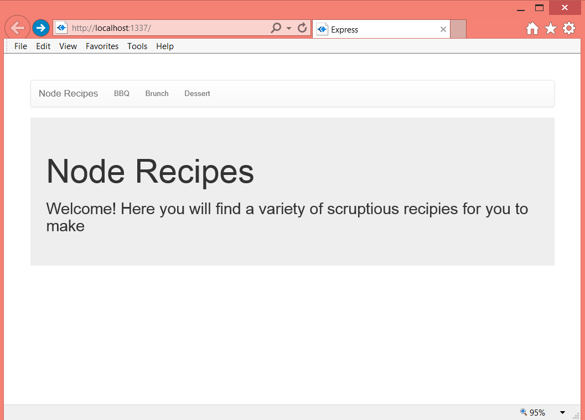

If you click on any of the items in the navbar you'll see that you get a page not found error:

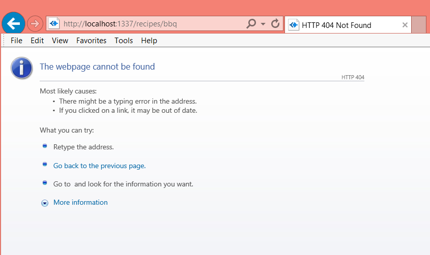

In the next section we will implement the views for each of the recipe kind.

##Creating the Recipes Route

To create a new Recipe route add a new javascript file to the routes folder:

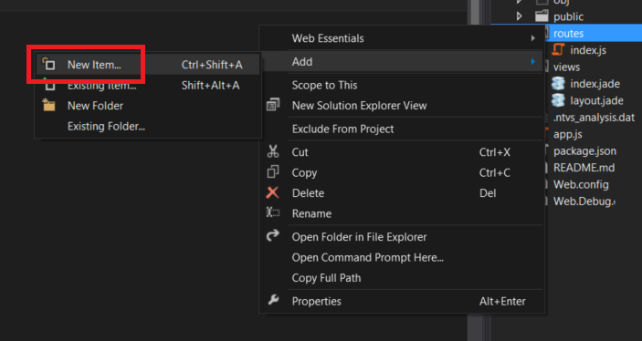

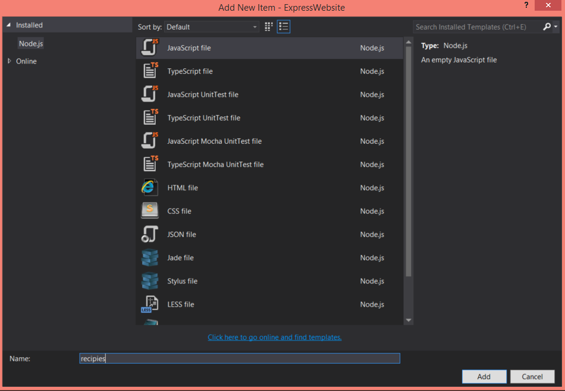

Create a new route handler **list**:

    exports.list = function (req, res) {

	}

Add a reference to **data.js**, our data source for recipes:

	var recipies = require('../data/recipesData.js');

	exports.list = function (req, res) {	

	}

Now in **app.js** add a reference to **./routes/recipes**'

	var recipes = require('./routes/recipes.js');

Then add a route that will use the recipe type as the **id** of the recipe collection and assign it to the recipes.list handler:

	//default route
	app.get('/', routes.index);
	app.get('/recipes/:id', recipes.list);

The last piece we need is to create a new view is to create a new jade template file under the **views** folder:

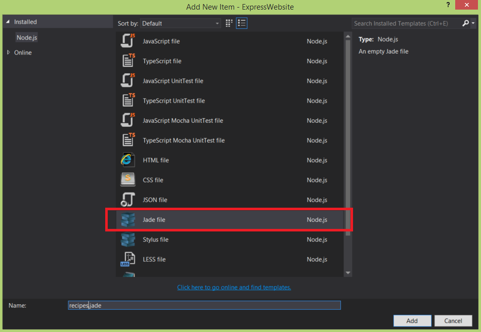

Your views folder should look like this now:

Let's go back and take a look at **data/recipeData.js**:

	/**
    This is the data source for your application. In the real world, you would either get this data from a data base or
    from an API 
	**/
	exports.recipeTypeName = {
	    bbq : 'Barbeque',
	    dessert : 'Dessert',
	    brunch : 'Brunch'
	}
	exports.bbq = [
	    {
	    name: 'Make-It-Mine Pork Kabobs',
	    ingredients: ["1 pound boneless pork loin or tenderloin",
	            "1 Onion",
	            "1 Zuchhini",
	            "1 Shitake Mushroom"
	        ],
	    photo : 'http://images.media-allrecipes.com/userphotos/250x250/01/07/80/1078019.jpg'
	},
	{
	    name: 'San Diego Grilled Chicken',
	    ingredients: ["1 pound boneless pork loin or tenderloin",
	            "1 Onion",
	            "1 Zuchhini",
	            "1 Shitake Mushroom"
	        ],
	    photo : 'http://images.media-allrecipes.com/userphotos/250x250/00/62/02/620268.jpg'
	},
	...
	]

	exports.brunch = [
	    {
	    name: 'Breakfast Scones',
	    ingredients: ["1 pound boneless pork loin or tenderloin",
	            "1 Onion",
	            "1 Zuchhini",
	            "1 Shitake Mushroom"
	        ],
	    photo : 'http://images.media-allrecipes.com/userphotos/250x250/00/01/71/17102.jpg'
	},
	{
	    name: 'Veggie-Bean Brunch Casserole',
	    ingredients: ["1 pound boneless pork loin or tenderloin",
	            "1 Onion",
	            "1 Zuchhini",
	            "1 Shitake Mushroom"
	        ],
	    photo : 'http://images.media-allrecipes.com/userphotos/250x250/00/88/68/886877.jpg'
	},
	...
	]

	exports.dessert = [
    {
	    name: 'Red, White and Blue Strawberry Shortcake',
	    ingredients: ["1 Cake",
	            "1 Red",
	            "1 Whit",
	            "1 Shitake Mushroom"
	        ],
	    photo : 'http://images.media-allrecipes.com/userphotos/250x250/00/97/60/976034.jpg'
	},
	{
	    name: 'All American Trifle',
	    ingredients: ["1 pound boneless pork loin or tenderloin",
	            "1 Onion",
	            "1 Zuchhini",
	            "1 Shitake Mushroom"
	        ],
	    photo : 'http://images.media-allrecipes.com/userphotos/250x250/01/17/91/1179163.jpg'
	},
	...
	]

In lieu of using a data source like a database or an API, we will use this file as our data source for recipes. **recipesData** contains 4 exported properties:

	
1. 	**recipiesData.recipeTypeName** - A key/value pair that maps the recipe type name like 'BBQ' to Barbecue
2. 	**recipiesData.bbq** - A collection of Barbecue recipes
3. 	**recipiesData.brunch** - A collection of Brunch recipes
4. 	**recipiesData.dessert** - A collection of Dessert recipes

Now that we have an idea of what our data looks like we can use express to render a recipe collection to the **recipe.jade** view. We will back the recipe view with the model:

	{
		recipes: {
			list: <Collection of recipe objects from recipesData.js>,
			kind: <name of the recipe kind>
		}
	}

In the route handler **recipes.js** we will use the **res.render** function will allow us to render a view, with a model to the page:

	var recipes = require('../data/recipesData.js');
	
	exports.list = function (req, res) {
	
	    var kind = req.params.id;
	    
	    res.render('recipes', {
	        recipes: {
	            list: recipes[kind],
	            kind: recipes.recipeTypeName[kind]
	        }
	    });
	}

This will render the jade view **recipe** and back that the view with the data in **recipes** object.

Run the website and you'll notice when you click on any of the navbar items you get a blank page:

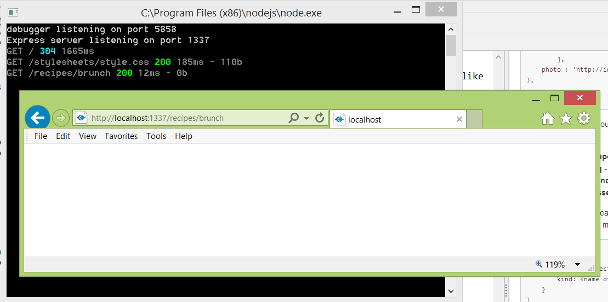

This is because the view template **recipes.jade** is blank.

#Creating the Recipes View Template

This is the easy part! We've already created our route, and attached our view to our data model. Now all we have to do is specify the jade template code so that the recipe shows up on our page.

The first thing we need to do is to declare that **recipes.jade** is an *extension view* of **layout.jade**:

**layout.jade**
    
	extends layout

Now that we've done this, running the website again will show you that we get the navBar from layout.jade:

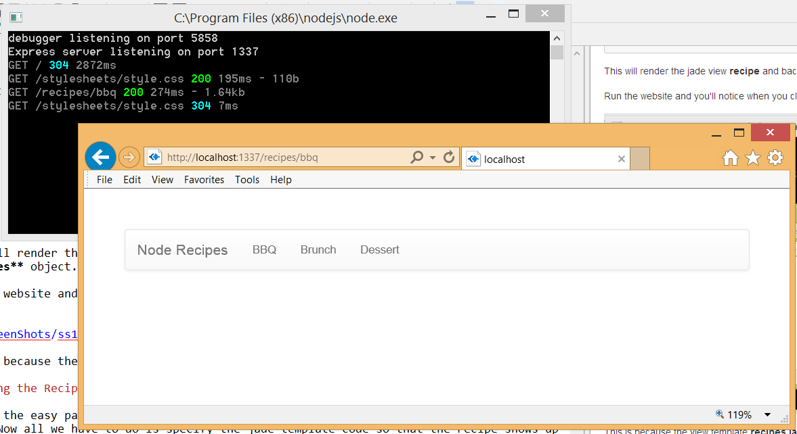

However the page is still blank. First we should add a **pageTitle** block. Layout.jade will place the html in that block first:

	extends layout

	block pageTitle
		//this will get displayed in the pageTitle block in layout.jade.
		//This makes a reference backing data model of this page
		h1 #{recipes.kind}

The **#{recipes.kind}** is an important concept with Jade and will use the backing data model's **recipes.kind** value as the title of the page.

Run the website again and you will see the clicking on a tab will change the title of the page. This is because the underlying data for the template is changing even though the actual template, **recipes.jade** does not:

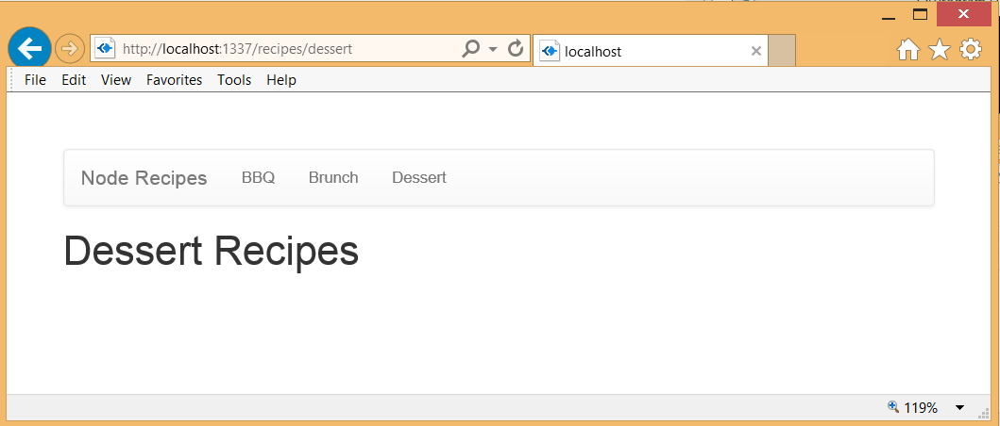

Now the most important part of course is where we will display the recipe data. First we need to specify a block **pageContent** which also comes from **layout.jade**. This block will be displayed after the **pageTitle** block.

    block pageContent

		ul

Now we will use another one of jade's important features. Jade allows us to create programmatic loops to repeat generating repetitive pieces of html. We can use these loops to iterate though the **recipes.list** recipe collection in the backing data model.

	block pageContent

		ul
		each recipe in recipes.list
			h2 #{recipe.name}

Run your website and see how it looks:

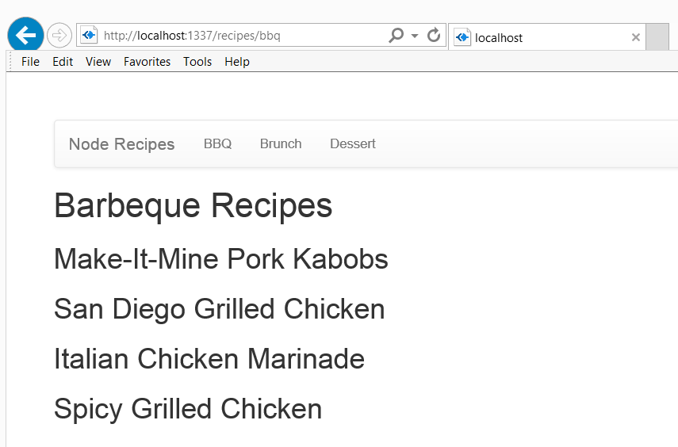

The **each** jade statement will actually iterate through a collection in the underlying data model. In this case, jade is going to print out with an h2 header the **name** field on every item in the **recipes.list** collection.

We can do a bit better on the UI layout by using the bootstrap [**well**](http://getbootstrap.com/components/#wells)  UI widget.

	block pageContent

    ul
    each recipe in recipes.list
        //create a new well for each recipe model
        .well
            h2 #{recipe.name}
            img(src='#{recipe.photo}')

Reload your webpage and you'll see that a well is created to contain the recipe. We also added the photo as to boot!:

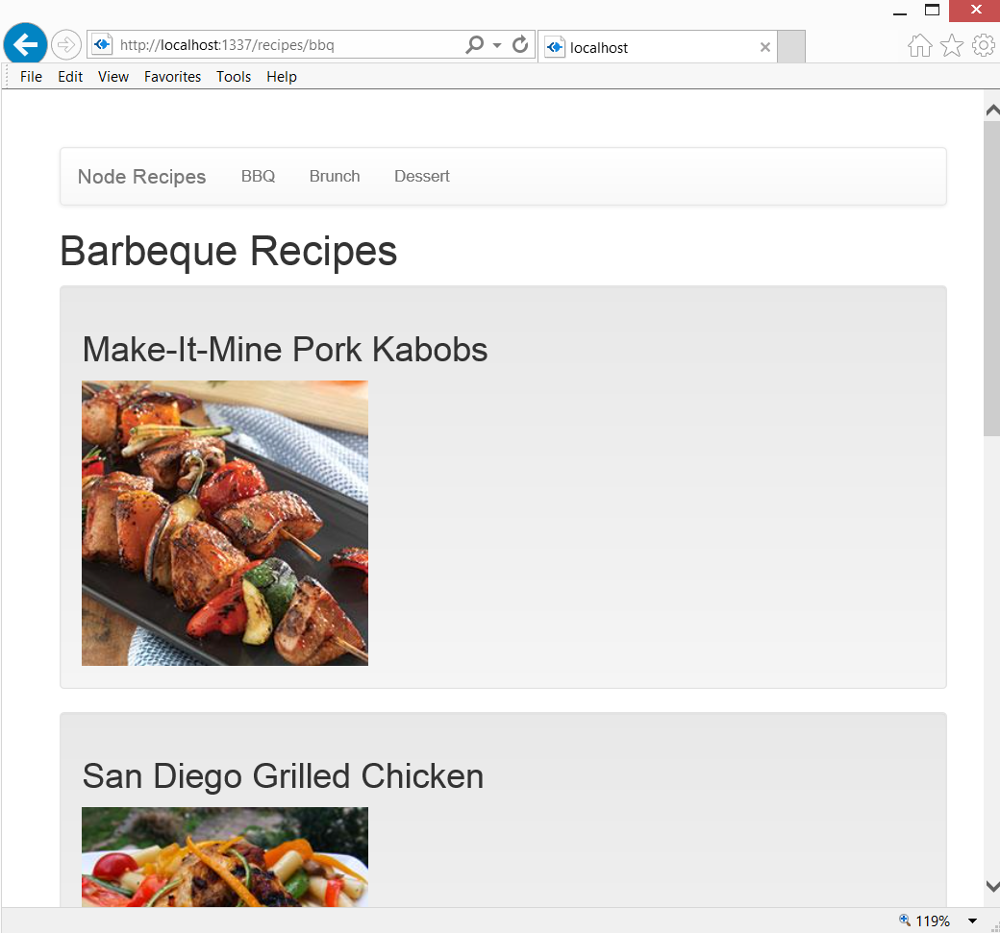

Now let's add the ingredients:

block pageContent

    ul
    each recipe in recipes.list
        //create a new well for each recipe model
        .well
            h2 #{recipe.name}
            img(src='#{recipe.photo}')
            h3 Ingredients
            h5
                ul
                each ingredient in recipe.ingredients
                    li=ingredient

Reload the page again and you'll see that you get the ingredients listed!

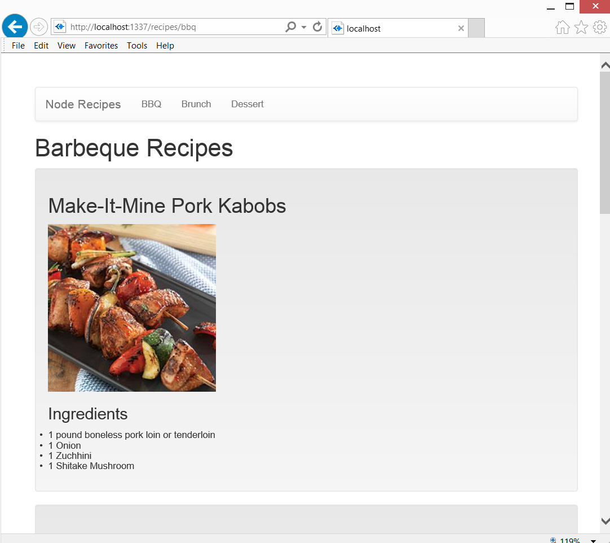

Switching between tabs changes the underlying data model and reloads the same template:

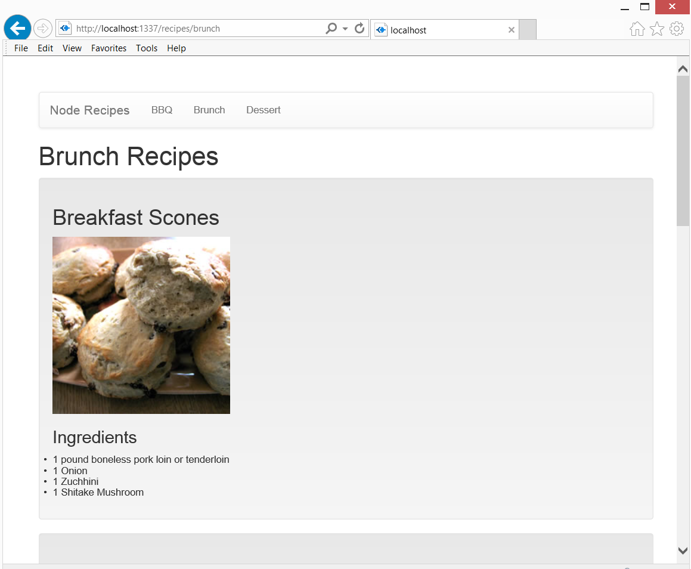

One more thing to note, this page is already **mobile optimized** thanks to bootstrap. The line:

**layout.jade**
	//indicate that our site is mobile optimized
    meta(name='viewport', content='width=device-width, initial-scale=1.0')

Actually tells mobile browsers that your website is optimized for mobile browsers. You can test how your site reacts to a smaller window by just re-sizing it:

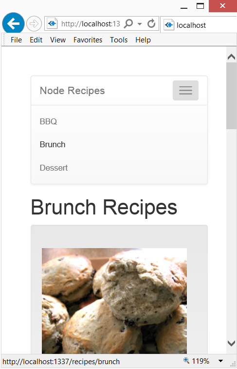

That's it! Congratulations you've created your first Node.js website!

